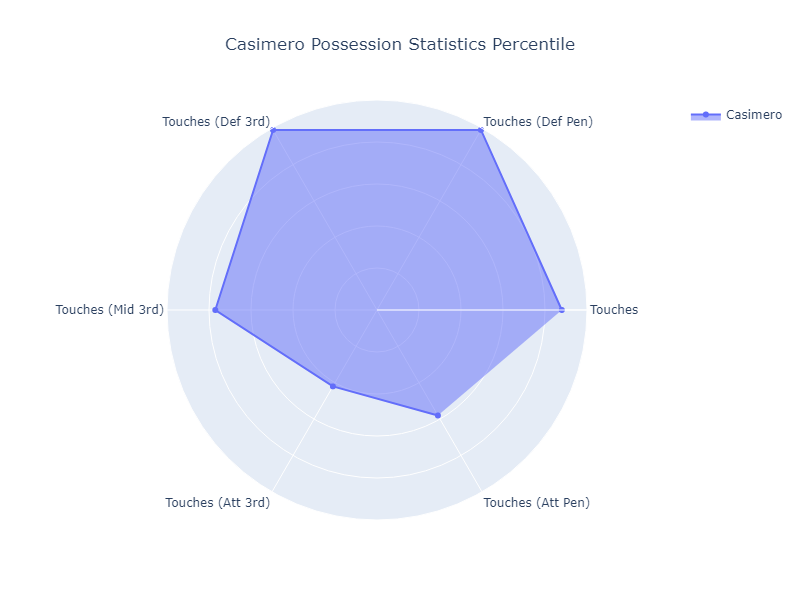
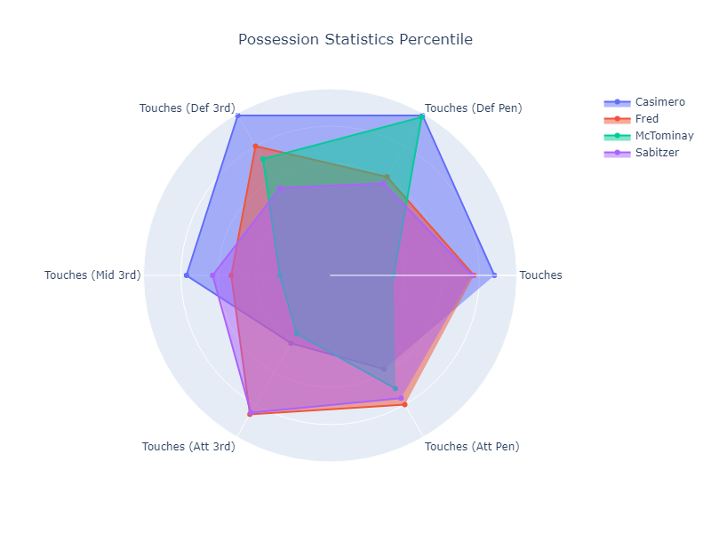
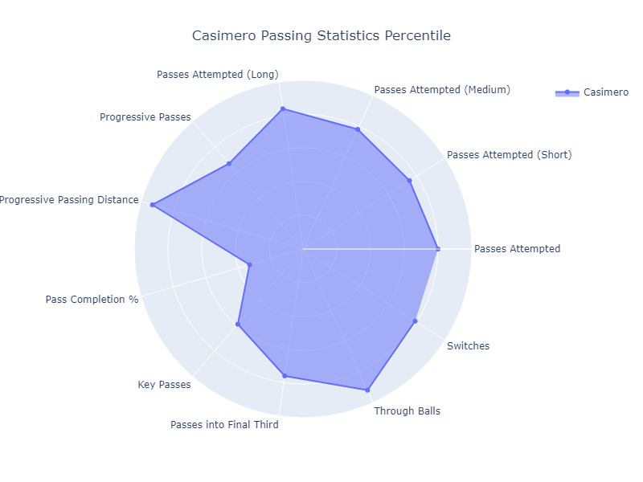
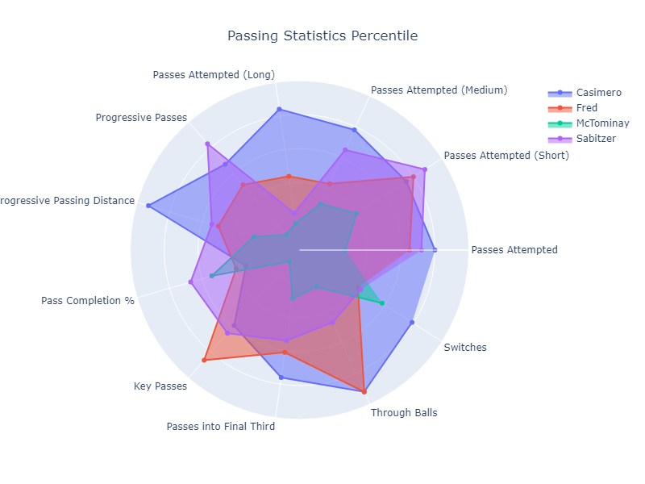
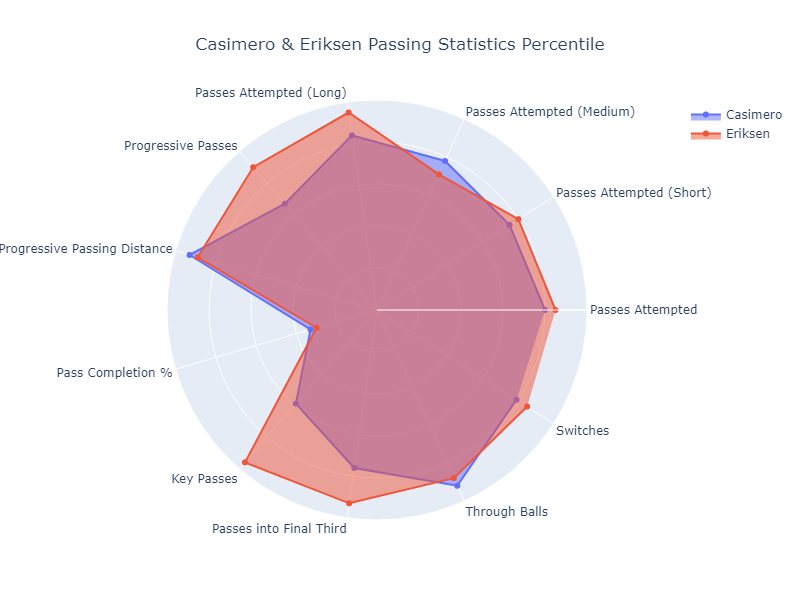
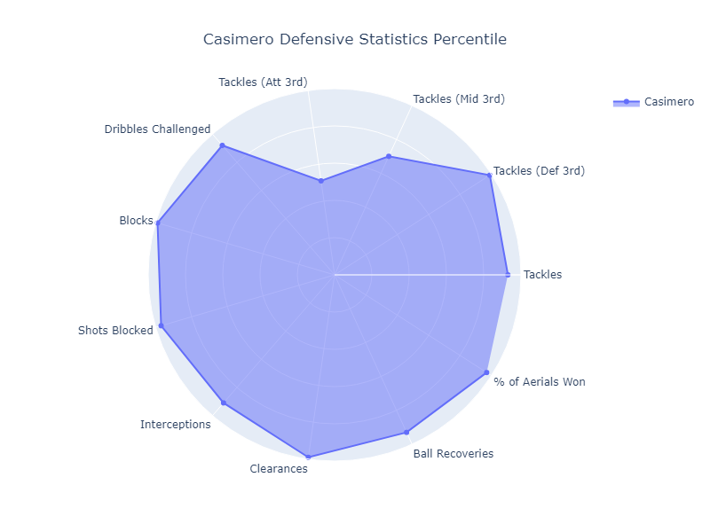
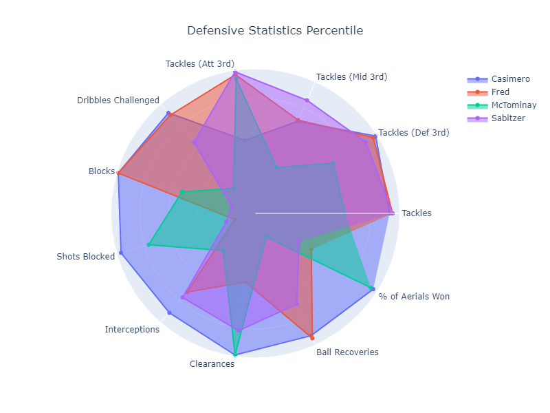

## Preface

I'll start by saying this - this is purely a statistical analysis. I watch all of United's game and will try to layer on some context, but my analysis here is primarily from the numbers. In any case - I was curious as to why we fall apart when Casimero doesn't play, and decided to dig into the numbers to investigate.

## Methodology

All of the data that I use comes from FBRef. I'm focusing on per 90 stats and their percentile. For anyone not familiar, if you're in the Xth percentile in a given metric, that means that you are better than X% of players in your position in that metric. For example, Casimero is in the 99th percentile of shots blocked - that means that he blocks more shots per game than 99% of midfielders out there in the last year.

I'll essentially look at key metrics in 3 phases of the game: possession, passing and defending. I will compare how well Casimero fares in all 3 areas and compare that to all other midfielders on our team.

I will use radar plots to visualize those metrics. These charts are usually easily interpretable - the closer to the edge of the circle you are, the higher the metric is. Each white circle on the radar represents 20 percentile. Let's get started.

## Possession

The possession chart above tells us a lot about Casimero's positioning. Here are the key takeaways:

* Casimero is incredibly involved in our possession, highlighted by his very high number of touches per game

* Most of those touches occur within our defensive 3rd up to our midfield. He does not touch much of the ball in the attacking 3rd or in the oppositions penalty box

* This confirms what we know - Casimero has been a deep lying playmaker for us, and most of our possession game goes through him starting from the back. Now let's compare that to our other CMs

Here are the key takeaways from adding Fred, Scott and Sabitzer to this equation:

* First, none of them as involved as suggested by the Touches metric where Casimero is above everyone else

* The majority of Fred and Sabitzer's touches are in the opponent's half, suggesting that neither of them are building from the back

* Everyone really lacks behind in terms of involvement in the middle of the field, and from the defense

* The main takeaway here is that we don't have a single player who can replicate Casimero's style in possession - most of them tend to get the ball much higher up the pitch

## Passing

Next, let's focus on some key metrics in regards to passing. As we did before, let's first start with just Casimero.

There are a few more metrics on this chart, but here are the main takeaways:

* Overall, Casimero impacts the game through switches and line breaking passes

* This is suggested first by the combination of his low positioning as identified above, and looking at his medium/long passes attempted, as well as progressive pass distance, switches, through balls and passes into the final third

* In short, Casimero sits deep, looks to switch the field, or find longer line breaking passes into the final third

* Just as we did before, let's compare with our other CMs

* Visually, we can already see that no one has a similar passing profile. These guys sit higher up the field for the most part, and don't attempt nearly as many passes

* The majority of their passes are short and look to be either backwards or sideways, suggested by everyone's low progressive pass rate

* Sabizter does have a higher progressive pass rate, but again, looking at his distribution and progressive passing distance, they all look to be very short passes making minimal progress towards the final third

One interesting note here, is that Casimero's passing profile is overwhelmingly similar to Eriksen's. This suggest that Casimero has been able to emulate some of Eriksen's influence on the game, and why we were still able to play well without Eriksen when Casimero played.

## Defending

This is obviously where Casimero shines, and where we'll see an even bigger dearth of aptitude from our other players.

* Simply put, Casimero is a defensive God. He hits the high 90th percentile in almost every defensive metric

* The only ones he scores lowly in are the locations of his tackles - the majority of his tackles happen in the defensive and middle third, and very few in the attacking third.

* This means that he's not pressing very high up - his job is to win the ball in our half through tackles or interceptions.

* This presumably allows him to cover well for the defense as he's essentially relieved from high press duties

* This better cover can be seen from his high stats in blocks, clearances and recoveries

* First, we can see that not a single one of our 3 CMs provide any sort of defensive cover - they all have mostly horrible blocking and interception rates

* All 3 CMs press really high up the field as well as suggested by their high tackles in the attacking third. Unlike Casimero's who main job is to stay back defending it would appear

* McTominay presses high well, but barely makes any tackles in the defensive side of the field. He looks to be just one big body that wins the ball in the air and clears it a lot

* Overall, not a single one of our 3 CM offer any where near the defensive output that Casimero does

## Conclusion

Casimero is the center piece of our playstyle. Our possession game starts with him sitting back as he helps progress the ball further forward by line breaking passes, or switches in play - at which point the rest of the attack is handled by Bruno, Rash and so on. This positioning allows him to stay further back, and when we lose the ball he's already in position providing defensive coverage.

He is so pivotal to all major aspects of our playstyle, but none of our 3 viable subs for him offer anywhere near what in does, in any aspect. They can't help with possession like he does, progress the ball like he does, or provide defensive coverage like he does

So when he is out, we are left with 3 players, none of whom can replicate anyone of the three main aspects of his role. Now, I'm sure you didn't need my charts to tell you that, but I always find it better to support theory with evidence, so here it is.

In my next analysis, I plan on using some unsupervised machine learning algorithms to try to find similar players to him as transfer targets. Stay tuned!